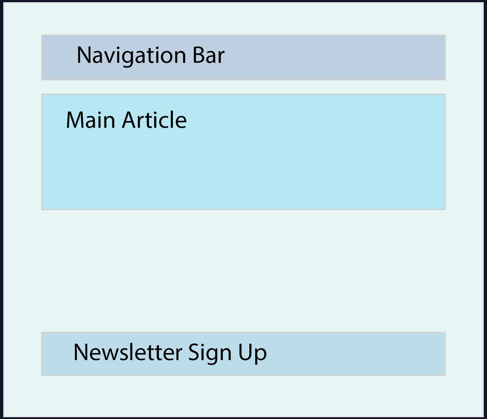

# Lesson 1 - Getting Started with React

## Introduction

You know what React is and you might even have an idea of where to use it. Now, it’s time to start figuring out how.

This lesson is going to cover starting a new React project on your machine, as well as some useful tools to help you along the way. We’ll also explain some of the problems that may arise (and how to avoid them).

## Lesson Overview

This section contains a general overview of topics that you will learn in this lesson.

- How React projects can be created.
- How to use Vite to create new React projects.
- How to format the code in React projects.
- What React Developer Tools are.

## Many Paths

There are multiple ways to start using React in your projects, from attaching a set of `<script>` tags which serve React from a CDN, to robust toolchains and frameworks that are highly configurable and allow for increased scalability and optimization.

Some examples of these toolchains include:

- Vite’s React Config
- Gatsby
- NextJS
- Create React App (Deprecated)

Why do we need these toolchains? Can’t we just make our own as we see fit?

Yes, but it’s **hard**. React is a complex beast and there are many moving parts. Before you can start writing any sort of code that provides functionality, you would need to configure **at least** the following:

- Package Management (NPM, Yarn)
- Module bundling (Webpack, Parcel)
- Compilation (Babel)
- React itself

All of this, and sometimes **much more**, is required to get a React project and development environment up and running.

### A note on Create React App

Create React App, or CRA, was the official way to scaffold new React projects since its introduction in 2016. Unfortunately, owing to many reasons, CRA was deprecated in early 2023. Due to CRA’s popularity, you’ll see it mentioned in many tutorials and guides. However, it’s no longer recommended to use it for new projects.

## Simplifying the Process

Now that you understand what is involved with starting a React project from scratch, you can breathe a sigh of relief to learn that we can get started with a **single terminal command**.

Vite builds frontend tools for developers and it leverages the latest technologies under the hood to provide a great developer experience. Fortunately, it also caters to the React ecosystem. We will use Vite’s CLI to quickly create a template React project. It requires minimal configuration and provides extremely useful tools right out of the box, allowing us to get straight to the learning. Let’s get started!

## Creating a React App

Please make sure that you are using the latest LTS version of Node, otherwise errors may occur. Open up the terminal and the folder containing your projects. Then enter the following command (you can replace `my-first-react-app` with any name you want):

```bash
npm create vite@latest my-first-react-app -- --template react
```

If you see the following output, enter `y` and then press `enter`:

```bash
Need to install the following packages:
  create-vite@5.X.X
Ok to proceed? (y)
```

Once the command has executed, it should output the next steps for you to follow:

```bash
cd my-first-react-app
npm install
npm run dev
```

Provided everything has gone according to plan, head over to `localhost:5173`, where you’ll be greeted with the following page:

## What is JSX?

JSX stands for **JavaScript XML**. It's a syntax extension for JavaScript that allows you to write HTML-like code directly within your JavaScript files.

- **Not HTML, Not a String:** Despite its visual similarity to HTML, JSX is **not** raw HTML. It's also not a string. Instead, it's a specialized syntax that gets transformed into regular JavaScript function calls during the build process.
- **Syntactic Sugar:** Think of JSX as "syntactic sugar" for `React.createElement()`. It provides a more concise and readable way to define UI elements compared to writing verbose `React.createElement()` calls directly.
- **Used Primarily with React:** While JSX is not exclusively bound to React (it can be used with other libraries if properly transpiled), its primary application is within the React ecosystem to describe the structure of the user interface.
- **Embedding JavaScript Expressions:** A powerful feature of JSX is the ability to embed JavaScript expressions directly within your HTML-like code. This is achieved by enclosing the expressions in curly braces `{}`. This enables dynamic content rendering.

**Example of JSX:**

```jsx
const name = "Alice";
const element = <h1>Hello, {name}!</h1>;
```

## Advantages of React :

- Component-Based Architecture: Encourages building UIs from small, reusable components, leading to modular, maintainable, and scalable code.
- Declarative UI: You describe what your UI should look like for a given state, and React efficiently updates the DOM, simplifying development and debugging.
- Virtual DOM: React uses an in-memory Virtual DOM to efficiently update the real DOM, minimizing direct manipulations and boosting performance.
- Rich Ecosystem and Community: A large, active community provides extensive resources, tools, and third-party libraries, along with strong job market demand.

## Key Folders & Files:

- **`public/`**: Stores static assets served directly by the server, like `index.html` and un-processed images.
- **`src/`**: Contains all your React application's source code. This is where you'll spend most of your time.
  - **`assets/`**: For images and other static files that get imported and processed by the bundler.
  - **`components/`**: Houses your reusable React components.
  - **`main.jsx`**: The application's entry point, which initializes and renders your main React component (`App.jsx`) into the HTML.
  - **`App.jsx`**: Your primary application component, acting as the root of your UI.
- **`.gitignore`**: Tells Git which files/folders to ignore.
- **`package.json`**: Defines project details, available scripts, and lists all project dependencies.
- **`vite.config.js`**: Configures how Vite builds and serves your project.

## React components

The beauty of React is that it allows you to break a UI (User Interface) down into independent reusable chunks, which we will refer to as components. The following picture should give you an idea of how to do that when building a very basic app.



## Functional components

````jsx
// src/components/Greeting.jsx

import React from 'react';

// Using a function declaration
function Greeting(props) {
  return (
    <div>
      <h2>Hello, {props.name}!</h2>
      <p>Welcome to your first functional component.</p>
    </div>
  );
}

// OR using an arrow function (common practice)
const Farewell = (props) => {
  return (
    <p>Goodbye, {props.name}!</p>
  );
};

export default Greeting; // Exporting the component to be used elsewhere
```jsx
````
